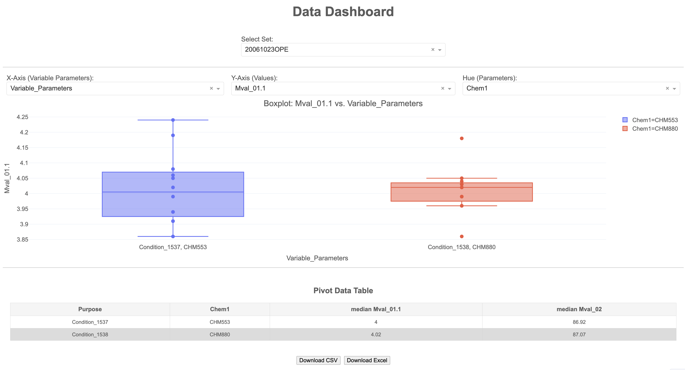

# Data Dashboard

An interactive data-analysis dashboard built with **Python**, **Pandas**, **Matplotlib**, **Plotly**, and **Dash**.

The dashboard reads data from a CSV file, cleans and processes the data, creates interactive Plotly boxplots, displays a median-value pivot table, and allows the processed results to be downloaded as CSV or Excel files.

---

## Features

- Load data from `Data.csv`
- Automatically remove:
  - Completely empty rows
  - Completely empty columns
  - Blank string values
- Filter data by `Set`
- Dynamically select:
  - X-axis variable parameters
  - Y-axis measurement values
  - Hue/grouping parameters
- Display interactive Plotly boxplots
- Display all data points on the boxplot
- Show median values in a pivot table
- Download the pivot table as:
  - CSV
  - Excel
- Interactive dashboard accessible through a web browser

---

## Dashboard Preview

The dashboard contains the following components:

1. **Set selector**  
   Select a dataset or experiment set.

2. **X-axis selector**  
   Select the parameter used for grouping the boxplot categories.

3. **Y-axis selector**  
   Select the measurement or value to display.

4. **Hue selector**  
   Group and colour the boxplots according to another parameter.

5. **Interactive boxplot**  
   Visualise the distribution of values for each selected category.

6. **Pivot Data Table**  
   View median values for the selected set.

7. **Export buttons**  
   Download the pivot data as CSV or Excel.

You can add a screenshot to the repository and update this section:

---

## Screenshot

"

---

## Project Structure
```
├── Dashboard.py
├── Data.csv
├── README.md
└── assets/
    └── dashboard_screenshot.png
```

---

## Requirements

- Python 3.9 or newer
- A CSV file named `Data.csv`
- The required Python packages

---

## Input Data
The application expects a file named: `Data.csv`

The file must be located in the same directory as `Dashboard.py`. The CSV file should contain a `Set` column because this column is used to filter the data in the dashboard. The program also expects a `Number` column, which is removed during preprocessing. Typical parameter and measurement columns may include:
* Set
* Number
* Purpose
* Chem1
* Chem2
* Parameter1
* Parameter2
* Mval_01
* Mval_02

The exact parameter and value columns available in the dashboard depend on the structure of the input CSV file.

---

## Data Preprocessing
When the application starts, it performs the following preprocessing steps:

* Reads `Data.csv` using UTF-8 encoding.
* Replaces blank or whitespace-only cells with missing values.
* Removes completely empty columns.
* Removes completely empty rows.
* Removes the `Number` column.
* Identifies the unique values in the Set column.
* Uses the selected set for further analysis.


## Running the Dashboard
Start the application with:

```bash
python Dashboard.py
```

---

The application runs on port `8050`.

Open the following URL in your web browser:

```text
http://127.0.0.1:8050/
```

If the application is running on another computer or server, use:

```text
http://<server-ip-address>:8050/
```
---

## Using the Dashboard

### 1. Select a set
Use the **Select Set** dropdown to choose a dataset.

The dashboard initially selects the last available value in the `Set` column.

### 2. Select the plot parameters
Choose the following values:

* **X-Axis:** The variable used to group the observations
* **Y-Axis:** The numerical measurement to analyse
* **Hue:** The parameter used to divide the data into separate boxplots
 
The dropdown options are updated automatically after selecting a set.

#### 3. Interpret the boxplot
The boxplot displays:

* Median
* Lower and upper quartiles
* Whiskers
* Individual observations

Individual data points are displayed on the plot using Plotly's `boxpoints='all'` option.

### 4. Review the pivot table
The pivot table displays median values calculated from the processed data for the selected set.

### 5. Export the results
Use one of the following buttons:

* **Download CSV**
* **Download Excel**
 
The exported filename is generated from the selected set:

```text
<selected_set>_median_value.csv
<selected_set>_median_value.xlsx
```
---

## Application Configuration
The application is configured to run using:

```python
app.run(host='0.0.0.0', port=8050, debug=True)
```

The application can be accessed locally at:

```text
http://127.0.0.1:8050/
```

For normal or production use, it is recommended to disable debug mode:

```python
app.run(host='0.0.0.0', port=8050, debug=False)
```

---


## Important Notes

* `Data.csv` must be present in the application directory.
* The `Set` column is required.
* Measurement columns used for the Y-axis should contain numerical values.
* Column names in the CSV file must match the names expected by the application.
* If no valid X-axis or Y-axis value is selected, the dashboard displays a message asking the user to select plotting parameters.


## The dashboard cannot be accessed from another computer
Make sure:

* The application is running with `host='0.0.0.0'`
* Port 8050 is allowed through the firewall
* You are using the correct IP address of the host computer

---

## Future Improvements
Possible future enhancements include:

* Uploading CSV files directly through the dashboard
* Supporting multiple file formats
* Adding more chart types
* Adding date and numeric filters
* Allowing multiple set selections
* Adding summary statistics such as mean, standard deviation, and sample size
* Adding authentication for shared deployments
* Deploying the application to a cloud platform

---

## License
This project is currently available for personal or internal use.

If you would like to distribute or modify the project, add an appropriate open-source license, such as the MIT License.

Author
Created by **Brindaban Kundu**

GitHub:  https://github.com/BrindabanKundu